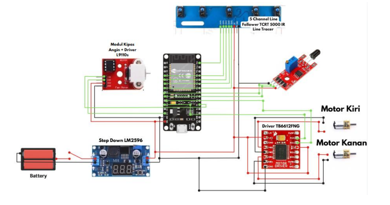

# Fire-Extinguisher-Line-Follower

## Line Follower Fire Fighting Robot with MQTT Integration

This project implements a **line follower–based fire fighting robot** integrated with an **IoT communication system using the MQTT protocol**. The robot is capable of autonomous navigation along a predefined path, detecting fire, performing simulated fire extinguishing using a DC fan, and transmitting real-time status updates through an MQTT broker.

This project was developed as a **final project for a Robotics course**, focusing on the integration of **embedded systems, robotic control, computer vision, and IoT communication**.

---

## Key Features
- **5-channel line follower navigation** using a state machine–based algorithm
- **Camera-based fire detection** using Computer Vision (OpenCV)
- **MQTT communication** for real-time fire status
- **ESP32** as the main controller
- Simulated fire extinguishing using a **DC fan**
- Distributed system architecture (vision system + robot executor)

---

## System Architecture
The system consists of two main components:

1. **Fire Detection Unit (PC / Laptop)**
   - Camera-based fire detection using Python and OpenCV
   - Publishes fire status (`ADA_API` / `TIDAK_ADA_API`) to an MQTT broker

2. **Robot Executor Unit**
   - ESP32-based mobile robot
   - Subscribes to MQTT messages and responds accordingly
   - Controls motors, sensors, and fire extinguishing module

---

## Hardware Components
- ESP32 Dev Kit
- 5-Channel Line Follower Sensor
- Flame Sensor
- TB6612FNG Motor Driver
- DC Fan Module with L9110 Driver
- DC Motors and Wheels
- Acrylic Chassis
- 2 x 18650 Battery

---

## Software Stack

### Embedded System
- Arduino IDE
- ESP32 Board Support Package
- PubSubClient (MQTT Library)

### Computer Vision & IoT
- Python 3.8+
- OpenCV
- NumPy
- Paho-MQTT

---

## Communication Protocol (MQTT with Local Mosquitto Broker)

This project uses **MQTT (Message Queuing Telemetry Transport)** for communication between the fire detection system and the robot. The MQTT broker is **Mosquitto**, running locally on a laptop within the same Local Area Network (LAN).

### Broker Configuration
- **Broker**: Mosquitto
- **Host**: Laptop local IP address (e.g. `192.168.x.x`)
- **Port**: `1884` 

---

### Publish–Subscribe Mechanism

#### Publisher: Fire Detection System
The fire detection module processes camera frames in real time using OpenCV. When a change in fire detection status occurs, it publishes a message to the MQTT broker:

- **Topic**: `robot/fire`
- **Payload**:
  - `ADA_API` → Fire detected
  - `TIDAK_ADA_API` → No fire detected

Messages are sent **only when the detection state changes**

---

#### Subscriber: ESP32 Robot
The ESP32 subscribes to the `robot/fire` topic and continuously listens for incoming messages.

- `ADA_API` → Robot heading towards the fire and activates the fan if line sensor detected allWhite and Fire sensor detect fire
- `TIDAK_ADA_API` → Robot resumes normal navigation or returns to base

This decoupled architecture allows independent development of the vision system and the robot controller.

---
